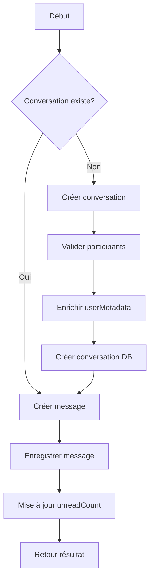
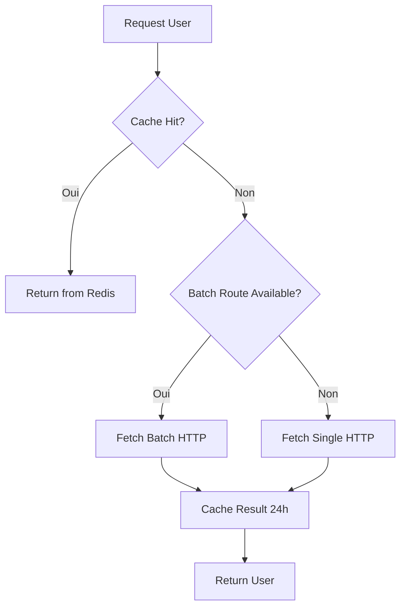
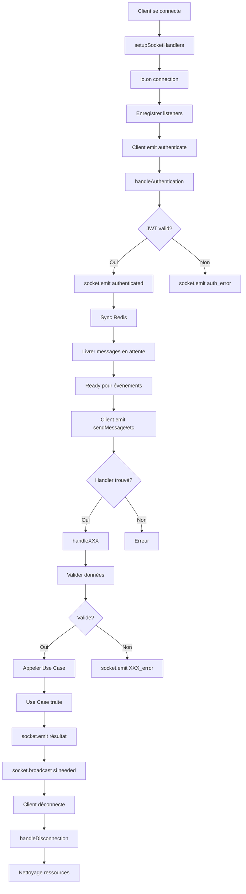

# ARCHITECTURE FONCTIONNALITES

Ce document est une fusion automatisée des fichiers de documentation suivants :


---
## Fichier d'origine : `USE_CASES_REFERENCE.md`

# 📚 Référence des Use-Cases (Clean Architecture)

Ce document liste de manière exhaustive les **Use-Cases** (cas d'utilisation métier) implémentés dans l'architecture des différents microservices de **ChatApp nGomna**. 

Chaque use-case encapsule une logique métier spécifique et orchestrée au niveau de la couche "Application", sans se préoccuper des détails d'infrastructure.

---

## 🟢 Chat-File-Service (`/chat-file-service/src/application/use-cases/`)

| Use-Case | Description métier |
|---|---|
| `AddAdmin.js` | Nommer un utilisateur existant comme administrateur d'un groupe de discussion. |
| `AddParticipant.js` | Ajouter un nouvel utilisateur à un groupe ou une conversation existante. |
| `AddReaction.js` | Ajouter une réaction (par exemple, un émoji) à un message spécifique. |
| `ArchiveConversation.js` | Archiver une conversation pour un utilisateur (masquer de la liste principale). |
| `AutoGroupSync.js` | Synchroniser automatiquement les membres d'un groupe avec un système externe ou un critère spécifique. |
| `CreateBroadcast.js` | Créer une liste de diffusion ou envoyer un message de broadcast. |
| `CreateGroup.js` | Créer un nouveau groupe de discussion avec plusieurs participants. |
| `DeleteFile.js` | Supprimer logiquement et/ou physiquement un fichier attaché ou uploadé. |
| `DeleteMessage.js` | Supprimer un message (soit uniquement pour l'utilisateur `SELF`, soit pour tous `EVERYONE`). |
| `DownloadFile.js` | Récupérer et générer un lien de téléchargement sécurisé pour un fichier. |
| `ForwardMessage.js` | Transférer un ou plusieurs messages existants vers d'autres conversations cibles. |
| `GetArchivedConversations.js` | Obtenir la liste paginée des conversations archivées de l'utilisateur. |
| `GetConversation.js` | Récupérer les détails et métadonnées d'une conversation spécifique. |
| `GetConversationIds.js` | Récupérer uniquement la liste des IDs des conversations auxquelles appartient un utilisateur. |
| `GetConversations.js` | Obtenir la liste paginée des conversations actives d'un utilisateur, avec le dernier message. |
| `GetFile.js` | Récupérer les métadonnées (nom, taille, type) d'un fichier. |
| `GetMessageById.js` | Consulter un message spécifique par son identifiant unique. |
| `GetMessages.js` | Récupérer l'historique des messages d'une conversation avec prise en charge de la pagination. |
| `LeaveConversation.js` | Permettre à un utilisateur de quitter une conversation de groupe. |
| `MarkMessageDelivered.js` | Accuser la réception (DELIVERED) d'un message sur l'appareil du destinataire. |
| `MarkMessageRead.js` | Accuser la lecture (READ) d'un ou plusieurs messages dans une conversation. |
| `RemoveParticipant.js` | Retirer (exclure) un utilisateur spécifique d'un groupe. |
| `RemoveReaction.js` | Retirer une réaction précédemment ajoutée sur un message. |
| `ReplyMessage.js` | Répondre à un message (création d'un lien de parenté / thread entre deux messages). |
| `SearchOccurrences.js` | Rechercher l'occurrence de termes spécifiques dans l'historique des messages. |
| `SendMessage.js` | Cœur du système : valider, sauvegarder et diffuser un nouveau message texte, fichier ou image. |
| `UpdateCallStatus.js` | Mettre à jour l'état d'un appel audio/vidéo (début, fin, rejeté, etc.). |
| `UpdateMessageContent.js` | Modifier le contenu texte d'un message existant (Edition de message). |
| `UpdateMessageStatus.js` | Mettre à jour des statuts internes ou administratifs liés au cycle de vie d'un message. |
| `UploadFile.js` | Gérer l'upload de fichiers, y compris le découpage (chunking) pour les très gros fichiers. |

---

## 🔵 Auth-User-Service (`/auth-user-service/src/application/use-cases/`)

| Use-Case | Description métier |
|---|---|
| `BatchGetUsers.js` | Récupérer les profils complets de plusieurs utilisateurs en une seule requête optimisée. |
| `CreateUser.js` | Créer (inscrire) un nouvel utilisateur dans la base de données d'authentification. |
| `DeleteUser.js` | Supprimer le compte et les données associées d'un utilisateur. |
| `GetAllUsers.js` | Obtenir la liste complète des utilisateurs du système (réservé aux admins / synchronisations). |
| `GetUserById.js` | Obtenir les informations détaillées d'un utilisateur spécifique. |
| `LoginUser.js` | Authentifier un utilisateur (matricule/mot de passe) et générer les JWT (Access/Refresh tokens). |
| `UpdateUserProfile.js` | Modifier les informations du profil utilisateur (nom, avatar, préférences). |


---
## Fichier d'origine : `CREATION_GROUPES_CHANNELS.md`

# Création de Groupes et Channels via HTTP

## Architecture des URLs

Le gateway proxifie les requêtes `/api/chat/*` vers le `chat-file-service`. Le service expose la route sur `/groups`.

**URL complète via le gateway :**

```
POST http://<gateway_host>:<port>/api/chat/groups
```

**URL directe vers le chat-file-service :**

```
POST http://<chat-file-service_host>:<port>/groups
```

---

## Créer un Groupe

```http
POST /api/chat/groups
Content-Type: application/json

{
  "name": "Mon Groupe",
  "adminId": "<matricule_du_créateur>",
  "members": ["<matricule1>", "<matricule2>", "<matricule3>"],
  "type": "GROUP"
}
```

## Créer un Channel

La seule différence est la valeur du champ `type` :

```http
POST /api/chat/groups
Content-Type: application/json

{
  "name": "Mon Channel",
  "adminId": "<matricule_du_créateur>",
  "members": ["<matricule1>", "<matricule2>"],
  "type": "CHANNEL"
}
```

---

## Champs du body

| Champ         | Requis | Description                                    |
| ------------- | ------ | ---------------------------------------------- |
| `name`        | ✅     | Nom du groupe/channel                          |
| `adminId`     | ✅     | Matricule de l'utilisateur créateur (admin)    |
| `members`     | ✅     | Tableau non vide de matricules d'utilisateurs  |
| `type`        | ❌     | `"GROUP"` (défaut) ou `"CHANNEL"`              |
| `groupId`     | ❌     | ID personnalisé (auto-généré sinon)            |
| `finalAdmins` | ❌     | Tableau de matricules d'admins supplémentaires |

---

## Réponses

### Succès (201)

```json
{
  "success": true,
  "message": "Groupe créé avec succès",
  "data": {
    "_id": "...",
    "name": "Mon Groupe",
    "type": "GROUP",
    "members": ["<matricule1>", "<matricule2>", "<matricule3>"],
    "admins": ["<matricule_du_créateur>"],
    "createdAt": "2026-03-19T..."
  }
}
```

### Erreur 400 — Champs manquants

```json
{
  "success": false,
  "message": "name, adminId et members (tableau non vide) sont requis",
  "code": "MISSING_REQUIRED_FIELDS"
}
```

### Erreur 500 — Erreur interne

```json
{
  "success": false,
  "message": "Erreur lors de la création du groupe",
  "error": "Erreur interne"
}
```

---

## Note

L'authentification (`authMiddleware.authenticate`) est actuellement **commentée** sur la route de création de groupe, donc aucun token n'est requis pour le moment en développement.


---
## Fichier d'origine : `TYPING_INDICATOR_IMPLEMENTATION.md`

<!-- TYPING_INDICATOR_IMPLEMENTATION.md -->

# 📝 Implémentation du Typing Indicator - Côté Serveur

## 📋 Vue d'ensemble

Le système de **typing indicator** est maintenant implémenté côté serveur avec :

1. **TypingIndicatorService** - Consumer Redis Streams qui traite les événements typing
2. **Consumer Group Redis** - Pour la livraison fiable des événements
3. **Broadcast WebSocket** - Aux destinataires en temps réel
4. **Timeouts automatiques** - Fallback si le client crash

## 🏗️ Architecture

```
┌─────────────────────────────────────────────────────────────┐
│                  CLIENT (Chat Web/App)                      │
├─────────────────────────────────────────────────────────────┤
│                                                               │
│  TypingIndicator.js                                         │
│  - onUserTyping(conversationId)     → envoie "typing:start" │
│  - onUserStopTyping(conversationId) → envoie "typing:stop"  │
│  - Debounce 3s entre chaque refresh                         │
│  - Local timeout 8s pour affichage                          │
│                                                               │
└────────────────────────────────────────────────────────────┬─┘
                          │
                  Socket.IO emit
                  socket.emit("typing", {
                    conversationId,
                    event: "typing:start|refresh|stop"
                  })
                          │
                          ▼
┌─────────────────────────────────────────────────────────────┐
│              SERVEUR (chat-file-service)                     │
├─────────────────────────────────────────────────────────────┤
│                                                               │
│  ChatHandler.handleTyping()                                 │
│  - Envoie dans Redis Stream: "stream:events:typing"         │
│  - TTL: 60s (configuré dans StreamManager)                  │
│  - Fallback broadcast immédiat via Socket.IO                │
│                                                               │
│  ┌────────────────────────────────────────────────────────┐ │
│  │ Redis Stream: stream:events:typing (MAXLEN: 2000)      │ │
│  │ TTL: 60 secondes (auto-expiration)                     │ │
│  └──────────────────────────────────────────────────────┬─┘ │
│                                                          │    │
│  TypingIndicatorService.startConsumer()                │    │
│  - Consumer Group: "typing-indicators"                 │    │
│  - Consommation: Toutes les 50ms (ultra-temps-réel)  │    │
│  - Parse événements: start/refresh/stop              │    │
│                                                         │    │
│  ┌──────────────────────────────────────────────────────┘   │
│  │                                                            │
│  ▼                                                            │
│  handleTypingStart(conversationId, userId)                  │
│  - Marque comme actif dans activeTypings Map              │
│  - Broadcast aux participants via Socket.IO               │
│  - Configure timeout local (10s)                          │
│  - Gère debounce (1s min entre broadcasts)               │
│                                                            │
│  handleTypingRefresh(conversationId, userId)              │
│  - Vérifie debounce côté serveur                        │
│  - Reset timeout automatique                             │
│                                                            │
│  handleTypingStop(conversationId, userId)                │
│  - Supprime l'état actif                                │
│  - Broadcast "stop" aux participants                    │
│  - Annule le timeout                                    │
│                                                            │
└─────────────────────────────────────────────────────────────┘
                          │
              Socket.IO broadcast
              socket.emit("typing:indicator", {
                conversationId,
                userId,
                status: "start|refresh|stop"
              })
                          │
                          ▼
┌─────────────────────────────────────────────────────────────┐
│           AUTRES CLIENTS (Participants)                     │
├─────────────────────────────────────────────────────────────┤
│                                                               │
│  Socket.on("typing:indicator", data)                        │
│  → Appelle typingIndicator.onTypingIndicatorReceived(data) │
│                                                               │
│  TypingIndicator.showTypingIndicator(conversationId, userId)│
│  - Affiche "User is typing..." dans l'UI                   │
│  - Configure timeout 8s (si pas de refresh)                │
│                                                               │
│  TypingIndicator.hideTypingIndicator(conversationId, userId)│
│  - Cache l'indicateur après timeout ou "stop"              │
│                                                               │
└─────────────────────────────────────────────────────────────┘
```

## 📦 Composants Implémentés

### 1. **TypingIndicatorService**

**Fichier** : `chat-file-service/src/infrastructure/services/TypingIndicatorService.js`

**Responsabilités** :

- Consumer Redis Streams pour `stream:events:typing`
- Traite les événements: `typing:start`, `typing:refresh`, `typing:stop`
- Broadcast WebSocket aux destinataires
- Gestion des timeouts automatiques (10s)
- Debounce côté serveur (1s minimum entre broadcasts)

**Methods principales** :

```javascript
async startConsumer()                           // Démarrer le consumer
async consumeTypingEvents()                     // Boucle de consommation (50ms)
async processTypingEvent(msg)                   // Traiter un événement
async handleTypingStart(conversationId, userId) // Début du typing
async handleTypingRefresh(conversationId, userId) // Refresh debounce
async handleTypingStop(conversationId, userId)  // Arrêt du typing
async broadcastTypingStatus(conversationId, userId, status) // Broadcast WebSocket
setTypingTimeout(conversationId, userId)       // Configure timeout 10s
getTypingUsers(conversationId)                  // Liste des users en typing
```

### 2. **ChatHandler.handleTyping()**

**Fichier** : `chat-file-service/src/application/websocket/chatHandler.js`

**Modifications** :

- Envoie événement dans Redis Stream au lieu de broadcast direct
- Ajoute fallback Socket.IO pour clients classiques
- Parse `conversationId` et `userId` depuis socket

```javascript
handleTyping(socket, data) {
  // Envoie dans stream:events:typing
  // Fallback broadcast immédiat
}

handleStopTyping(socket, data) {
  // Envoie typing:stop dans stream
  // Fallback broadcast immédiat
}
```

### 3. **TypingIndicator.js** (Client)

**Fichier** : `chat-file-service/public/TypingIndicator.js`

**Responsabilités** :

- Gère l'état du typing côté client
- Debounce 3s sans activité
- Envoie 3 événements: start, refresh, stop
- Affiche/masque les indicateurs "is typing..."

**Methods principales** :

```javascript
onUserTyping(conversationId); // Utilisateur commence à taper
onUserStopTyping(conversationId); // Utilisateur arrête
onTypingIndicatorReceived(data); // Reçoit événement du serveur
showTypingIndicator(conversationId, userId); // Afficher UI
hideTypingIndicator(conversationId, userId); // Masquer UI
getTypingUsers(conversationId); // Liste des users qui tapent
```

## 🔌 Intégration

### 1. **Serveur - index.js**

```javascript
const TypingIndicatorService = require("./infrastructure/services/TypingIndicatorService");

// Dans la section initialisation (après MessageDeliveryService)
typingIndicatorService = new TypingIndicatorService(
  redisClient,
  io,
  conversationRepository,
);
await typingIndicatorService.startConsumer();
app.locals.typingIndicatorService = typingIndicatorService;
```

### 2. **Client - HTML**

```html
<!-- Dans votre page chat -->
<script src="/TypingIndicator.js"></script>

<div id="typing-indicator-${conversationId}" style="display:none;">
  <!-- Les indicateurs seront ajoutés dynamiquement -->
</div>

<textarea id="message-input" placeholder="Tapez un message..."></textarea>

<script>
  const socket = io();
  const typingIndicator = new TypingIndicator(socket);
  const currentConversationId = "..."; // Récupérer depuis votre app

  // ✅ QUAND L'UTILISATEUR TAPE
  const inputField = document.getElementById("message-input");

  inputField.addEventListener("input", () => {
    typingIndicator.onUserTyping(currentConversationId);
  });

  inputField.addEventListener("blur", () => {
    typingIndicator.onUserStopTyping(currentConversationId);
  });

  // ✅ QUAND ON REÇOIT UN INDICATEUR TYPING
  socket.on("typing:indicator", (data) => {
    typingIndicator.onTypingIndicatorReceived(data);
  });

  // ✅ QUAND ON FERME LA PAGE
  window.addEventListener("beforeunload", () => {
    typingIndicator.cleanup();
  });
</script>
```

## ⚙️ Configuration

### StreamManager - TTL Configuration

**Fichier** : `shared/resilience/StreamManager.js`

```javascript
// ✅ CONFIGURATION DES TTL (en secondes)
this.STREAM_TTL = {
  [this.MESSAGE_STREAMS.TYPING]: options.typingTtl || 60,
};

// ✅ Dans addToStream() - Applique le TTL
const ttlSeconds = this.STREAM_TTL?.[streamName];
if (typeof ttlSeconds === "number" && ttlSeconds > 0) {
  this.redis.expire(streamName, ttlSeconds).catch(() => {
    // Ignorer les erreurs d'expiration
  });
}
```

**MAXLEN du Stream** : 2000 (géré automatiquement)

### TypingIndicatorService - Configuration

```javascript
// Dans le constructor:
this.TYPING_TIMEOUT = 10000; // 10s - Timeout côté serveur
this.DEBOUNCE_INTERVAL = 1000; // 1s - Minimum entre broadcasts
this.STREAM_NAME = "stream:events:typing";
this.CONSUMER_GROUP = "typing-indicators";
```

### TypingIndicator (Client) - Configuration

```javascript
this.DEBOUNCE_DELAY = 3000; // 3s sans activité = refresh
this.LOCAL_TIMEOUT = 8000; // 8s de timeout côté client
this.MIN_TYPING_INTERVAL = 1000; // 1s minimum entre envois
```

## 🔄 Flux d'une Session de Typing

### Scénario 1: Utilisateur tape normalement

```
t=0s   : Utilisateur commence à taper
         → TypingIndicator.onUserTyping()
         → socket.emit("typing", event: "typing:start")

t=0s   : ChatHandler.handleTyping()
         → redis.xAdd("stream:events:typing", "typing:start")
         → Fallback broadcast immédiat

t=0s   : Autres clients reçoivent
         → socket.on("typing:indicator", ...)
         → Affichent "User is typing..."
         → Configure timeout 8s

t=3s   : Utilisateur continue à taper (debounce)
         → socket.emit("typing", event: "typing:refresh")
         → TypingIndicatorService reset timeout

t=6s   : Utilisateur continue (nouveau refresh)
         → socket.emit("typing", event: "typing:refresh")

t=8s   : Utilisateur arrête complètement
         → TypingIndicator.onUserStopTyping()
         → socket.emit("typing", event: "typing:stop")
         → Autres clients masquent l'indicateur
```

### Scénario 2: Client crash sans envoyer "stop"

```
t=0s   : Utilisateur tape, envoie "typing:start"

t=5s   : Client crash/déconnexion

t=10s  : TypingIndicatorService timeout expire
         → handleTypingStop() appelé automatiquement
         → Broadcast "stop" aux autres clients
         → Autres clients masquent l'indicateur

t=60s  : Redis stream entry expirée (TTL)
         → Nettoyage automatique
```

## 📊 Événements Redis Stream

### Structure de l'événement

```javascript
// Dans stream:events:typing
{
  conversationId: "conv_123",
  userId: "user_456",
  event: "typing:start",        // ou "typing:refresh" ou "typing:stop"
  timestamp: "1707204120000"
}
```

## 🧪 Test de l'Implémentation

### 1. Vérifier que le service démarre

```bash
npm start
# Devrait afficher:
# ✅ TypingIndicatorService initialisé
# 🚀 Démarrage du consumer typing...
# ✅ Consumer group créé: typing-indicators
# ✅ Consumer typing démarré
```

### 2. Ouvrir 2 clients et taper

- **Client A** : Ouvre chat, rentre dans une conversation
- **Client B** : Ouvre même conversation
- **Client A** : Commence à taper → **Client B** doit voir "A is typing..."
- **Client A** : Arrête → **Client B** doit voir disparaître l'indicateur

### 3. Test du timeout automatique

- **Client A** : Simule crash en fermant rapidement le tab
- **Client B** : Doit voir l'indicateur disparaître après 10s max

### 4. Vérifier les streams Redis

```bash
redis-cli
XLEN stream:events:typing
XRANGE stream:events:typing - +
```

## 🐛 Dépannage

### L'indicateur ne s'affiche pas

1. Vérifier que TypingIndicatorService est démarré:
   ```bash
   npm start 2>&1 | grep "TypingIndicatorService"
   ```
2. Vérifier que le conversationId passé est correct
3. Vérifier que les participants sont dans `conversation.participants`

### Les événements ne sont pas envoyés

1. Vérifier que `resilientMessageService.redis` existe
2. Vérifier les logs: `socket.on("typing", data) → redis.xAdd()`
3. Vérifier que le stream existe dans Redis

### Indicateur reste bloqué ("stuck")

1. Le timeout local du client est peut-être cassé
2. Vérifier la console du navigateur pour les erreurs
3. Vérifier que `updateTypingUI()` trouve le container HTML

## 📈 Performance

- **Consommation** : 50ms (ultra-rapide pour typing)
- **Redis Stream MAXLEN** : 2000 (gestion automatique)
- **Redis Stream TTL** : 60s (fallback de nettoyage)
- **Debounce client** : 3s (réduit trafic réseau)
- **Debounce serveur** : 1s (évite les broadcasts dupliqués)
- **Timeout serveur** : 10s (fallback automatique)
- **Timeout client** : 8s (plus court pour UX réactif)

## 🔐 Sécurité

- ✅ Validation de `conversationId` et `userId`
- ✅ Broadcast seulement aux participants de la conversation
- ✅ Les utilisateurs ne voient que les typings de leur conversation
- ✅ Pas de stockage persistant (stream TTL 60s)
- ✅ Pas de données sensibles (juste userId et conversationId)

## 🔗 Fichiers Modifiés

1. **Créés** :
   - `chat-file-service/src/infrastructure/services/TypingIndicatorService.js`
   - `chat-file-service/public/TypingIndicator.js`

2. **Modifiés** :
   - `chat-file-service/src/index.js` - Ajout TypingIndicatorService
   - `chat-file-service/src/infrastructure/index.js` - Export TypingIndicatorService
   - `chat-file-service/src/application/websocket/chatHandler.js` - handleTyping/handleStopTyping
   - `shared/resilience/StreamManager.js` - Ajout STREAM_TTL config + expire()
   - `chat-file-service/shared/resilience/StreamManager.js` - Same changes
   - `auth-user-service/shared/resilience/StreamManager.js` - Same changes


---
## Fichier d'origine : `UPLOAD_SYSTEM_DOCUMENTATION.md`

# 📤 Système d'Upload — Documentation complète

> **Service** : `chat-file-service`
> **Date** : 2 avril 2026
> **Approche** : Fusionnée (monolithique + chunké + idempotence)

---

## Table des matières

1. [Vue d'ensemble](#1-vue-densemble)
2. [Upload monolithique (≤ 100 MB)](#2-upload-monolithique--100-mb)
3. [Upload chunké (> 100 MB, jusqu'à 500 MB)](#3-upload-chunké--100-mb-jusquà-500-mb)
4. [Idempotence (upload_token)](#4-idempotence-upload_token)
5. [Vérification de statut](#5-vérification-de-statut)
6. [Clés Redis](#6-clés-redis)
7. [Stockage temporaire (chunks)](#7-stockage-temporaire-chunks)
8. [Limites et configuration](#8-limites-et-configuration)
9. [Architecture des fichiers](#9-architecture-des-fichiers)
10. [Diagrammes de flux](#10-diagrammes-de-flux)
11. [Intégration client Flutter/Dart](#11-intégration-client-flutterdart)
12. [Gestion d'erreurs](#12-gestion-derreurs)
13. [Nettoyage automatique](#13-nettoyage-automatique)

---

## 1. Vue d'ensemble

Le système d'upload supporte **deux modes** en fonction de la taille du fichier :

| Mode             | Taille            | Requête(s)                          | Idempotent            |
| ---------------- | ----------------- | ----------------------------------- | --------------------- |
| **Monolithique** | ≤ 100 MB          | 1 seule (`POST /files/upload`)      | ✅ via `upload_token` |
| **Chunké**       | > 100 MB → 500 MB | 3 étapes (init → chunks → complete) | ✅ via `upload_token` |

Les deux modes partagent le même mécanisme d'idempotence basé sur un `upload_token` UUID généré côté client.

**Fallback ACK perdu** : Le stream Redis `chat:stream:events:files` assure qu'un fichier enregistré en DB est toujours récupérable même si l'ACK HTTP est perdu.

---

## 2. Upload monolithique (≤ 100 MB)

### Endpoint

```
POST /files/upload
Content-Type: multipart/form-data
```

### Headers

| Header           | Requis     | Description                                                 |
| ---------------- | ---------- | ----------------------------------------------------------- |
| `user-id`        | ✅         | ID de l'utilisateur authentifié                             |
| `x-upload-token` | Recommandé | UUID d'idempotence (alternatif : champ body `upload_token`) |

### Body (multipart/form-data)

| Champ            | Type   | Requis | Description                    |
| ---------------- | ------ | ------ | ------------------------------ |
| `file`           | File   | ✅     | Le fichier à uploader          |
| `conversationId` | String | Non    | ID de la conversation associée |
| `upload_token`   | String | Non    | UUID d'idempotence             |

### Flux interne

```
Client                    FileController              MinIO/SFTP           MongoDB
  │                            │                          │                   │
  ├── POST /files/upload ─────▶│                          │                   │
  │   (multipart, ≤100MB)      │                          │                   │
  │                            ├── checkToken(token) ────▶│ Redis             │
  │                            │◀── null (nouveau) ───────┤                   │
  │                            │                          │                   │
  │                            ├── uploadFromBuffer() ───▶│                   │
  │                            │◀── remotePath ───────────┤                   │
  │                            │                          │                   │
  │                            ├── processFile() ─────────│ (métadonnées)     │
  │                            │                          │                   │
  │                            ├── generateThumbnails()───│ (si image ≤10MB)  │
  │                            │                          │                   │
  │                            ├── execute(fileData) ─────│──────────────────▶│
  │                            │◀── result ───────────────│◀─────────────────┤
  │                            │                          │                   │
  │                            ├── storeTokenResult() ───▶│ Redis             │
  │                            │                          │                   │
  │◀── 201 { success, data } ──┤                          │                   │
```

### Réponse succès (201)

```json
{
  "success": true,
  "data": {
    "id": "a1b2c3d4e5f6...",
    "originalName": "photo-vacances.jpg",
    "fileName": "a1b2c3d4e5f6.jpg",
    "path": "a1b2c3d4e5f6.jpg",
    "size": 4520000,
    "mimeType": "image/jpeg",
    "url": "a1b2c3d4e5f6.jpg",
    "metadata": { ... },
    "thumbnails": {
      "small": "thumbnails/a1b2c3d4e5f6_small.webp",
      "medium": "thumbnails/a1b2c3d4e5f6_medium.webp",
      "large": "thumbnails/a1b2c3d4e5f6_large.webp"
    }
  },
  "metadata": {
    "processingTime": "1523ms",
    "fileType": "IMAGE",
    "hasMetadata": true,
    "timestamp": "2026-04-02T12:00:00.000Z"
  }
}
```

### Réponse idempotente (200)

Si le même `upload_token` est renvoyé :

```json
{
  "success": true,
  "data": { ... },
  "idempotent": true,
  "metadata": {
    "processingTime": "12ms",
    "timestamp": "2026-04-02T12:00:05.000Z"
  }
}
```

---

## 3. Upload chunké (> 100 MB, jusqu'à 500 MB)

Pour les fichiers dépassant 100 MB, le client découpe le fichier en morceaux de **5 MB** et les envoie en 3 étapes.

### Étape 1 — Initialisation

```
POST /files/upload/init
Content-Type: application/json
```

**Body :**

```json
{
  "fileName": "video-4k.mp4",
  "fileSize": 256000000,
  "mimeType": "video/mp4",
  "totalChunks": 52,
  "upload_token": "550e8400-e29b-41d4-a716-446655440000",
  "conversationId": "64a1b2c3d4e5f6..."
}
```

**Headers requis :** `user-id`

**Réponse (201) :**

```json
{
  "success": true,
  "uploadId": "f47ac10b-58cc-4372-a567-0e02b2c3d479",
  "chunkSize": 5242880,
  "totalChunks": 52,
  "expiresAt": "2026-04-02T14:00:00.000Z"
}
```

**Réponse idempotente** (même `upload_token`, session existante) :

```json
{
  "success": true,
  "uploadId": "f47ac10b-...",
  "status": "in_progress",
  "uploadedChunks": [0, 1, 2, 3],
  "totalChunks": 52
}
```

---

### Étape 2 — Envoi des chunks

```
POST /files/upload/chunk/:uploadId
Content-Type: multipart/form-data
```

**Body (multipart/form-data) :**

| Champ        | Type   | Requis | Description                                                   |
| ------------ | ------ | ------ | ------------------------------------------------------------- |
| `chunk`      | File   | ✅     | Le morceau de fichier (≤ 5 MB)                                |
| `chunkIndex` | Number | ✅     | Index du chunk (0-based). Alternatif : header `x-chunk-index` |

**Réponse (200) :**

```json
{
  "success": true,
  "received": 5,
  "total": 52,
  "remaining": 46,
  "uploadedChunks": [0, 1, 2, 3, 4, 5],
  "isComplete": false
}
```

> **Note** : Les chunks peuvent être envoyés **dans n'importe quel ordre** et **réenvoyés** en cas d'échec (le même index écrase le précédent).

---

### Étape 3 — Finalisation

```
POST /files/upload/complete/:uploadId
```

**Headers requis :** `user-id`

**Flux interne :**

```
1. Vérifier que tous les chunks sont présents
2. Marquer la session "assembling"
3. Assembler les chunks en un fichier unique sur disque
4. Upload vers MinIO/SFTP via fPutObject (stream, pas de RAM)
5. Extraire les métadonnées (sharp, ffprobe, etc.)
6. Enregistrer en MongoDB via UploadFile use-case
7. Stocker token → résultat pour idempotence
8. Supprimer les chunks temporaires
```

**Réponse (201) :**

```json
{
  "success": true,
  "data": {
    "id": "f47ac10b58cc4372a5670e02b2c3d479",
    "originalName": "video-4k.mp4",
    "fileName": "f47ac10b-58cc-4372-a567-0e02b2c3d479.mp4",
    "size": 256000000,
    "mimeType": "video/mp4",
    "metadata": { ... }
  },
  "metadata": {
    "processingTime": "8523ms",
    "fileType": "VIDEO",
    "chunkedUpload": true,
    "totalChunks": 52,
    "timestamp": "2026-04-02T12:05:00.000Z"
  }
}
```

---

## 4. Idempotence (upload_token)

Le mécanisme d'idempotence empêche les **doublons** lors de réessais réseau.

### Principe

```
┌─────────────────────────────────────────────────────────┐
│  Le CLIENT génère un UUID v4 unique avant chaque upload │
│  et l'envoie comme upload_token dans chaque requête     │
└─────────────────────────────────────────────────────────┘
```

### Fonctionnement

| Étape                | Action                                                                                   |
| -------------------- | ---------------------------------------------------------------------------------------- |
| **1. Premier envoi** | Le serveur traite l'upload normalement                                                   |
| **2. Succès**        | Le serveur stocke `chat:cache:upload:token:{token} → JSON(résultat)` dans Redis (TTL 1h) |
| **3. Réessai**       | Le serveur détecte le token existant et retourne le résultat précédent sans re-traiter   |

### Comment envoyer le token

**Option A — Header HTTP :**

```
x-upload-token: 550e8400-e29b-41d4-a716-446655440000
```

**Option B — Champ body (multipart) :**

```
upload_token=550e8400-e29b-41d4-a716-446655440000
```

### Couverture

| Mode             | Où le token est vérifié                                          |
| ---------------- | ---------------------------------------------------------------- |
| Monolithique     | `FileController.uploadFile()` — avant traitement                 |
| Chunked init     | `ChunkedUploadService.initUpload()` — retourne session existante |
| Chunked complete | `FileController.completeChunkedUpload()` — stocke après succès   |

---

## 5. Vérification de statut

### Endpoint

```
GET /files/upload/status?token=xxx
GET /files/upload/status?uploadId=xxx
```

### Cas de réponse

**Upload monolithique terminé :**

```json
{
  "success": true,
  "status": "completed",
  "data": { "id": "...", "originalName": "...", ... }
}
```

**Upload chunké en cours :**

```json
{
  "success": true,
  "status": "uploading",
  "uploadId": "f47ac10b-...",
  "totalChunks": 52,
  "uploadedChunks": [0, 1, 2, 3, 4],
  "remaining": 47,
  "progress": 10,
  "expiresAt": "2026-04-02T14:00:00.000Z"
}
```

**Introuvable :**

```json
{
  "success": true,
  "status": "not_found"
}
```

### Ordre de recherche Redis

1. `chat:cache:upload:token:{id}` → upload monolithique terminé
2. `chat:cache:upload:token:session:{id}` → session chunked (par token)
3. `chat:cache:upload:chunked:{id}` → session chunked (par uploadId)

---

## 6. Clés Redis

| Clé                                       | Contenu                     | TTL    | Usage                              |
| ----------------------------------------- | --------------------------- | ------ | ---------------------------------- |
| `chat:cache:upload:token:{token}`         | JSON du résultat fichier    | **1h** | Idempotence monolithique + chunked |
| `chat:cache:upload:chunked:{uploadId}`    | JSON de la session d'upload | **2h** | État de l'upload chunké            |
| `chat:cache:upload:token:session:{token}` | JSON de la session d'upload | **2h** | Mapping token → session chunked    |

### Structure session chunked

```json
{
  "uploadId": "f47ac10b-58cc-4372-a567-0e02b2c3d479",
  "fileName": "video-4k.mp4",
  "fileSize": 256000000,
  "mimeType": "video/mp4",
  "totalChunks": 52,
  "uploadedChunks": [0, 1, 2, 3],
  "uploadToken": "550e8400-...",
  "userId": "user123",
  "conversationId": "conv456",
  "chunkDir": "/app/storage/chunks/f47ac10b-...",
  "status": "uploading",
  "expiresAt": "2026-04-02T14:00:00.000Z",
  "createdAt": "2026-04-02T12:00:00.000Z"
}
```

---

## 7. Stockage temporaire (chunks)

```
storage/
└── chunks/
    └── {uploadId}/
        ├── chunk_00000
        ├── chunk_00001
        ├── chunk_00002
        ├── ...
        └── {uploadId}.mp4    ← fichier assemblé (temporaire, supprimé après upload MinIO)
```

- **Emplacement** : `./storage/chunks/` (relatif au répertoire de travail du service)
- **Nommage** : `chunk_XXXXX` (index zéro-paddé sur 5 digits)
- **Nettoyage** : Automatique après `completeUpload()`, ou par `cleanupExpired()` après 2h

---

## 8. Limites et configuration

| Paramètre                               | Valeur         | Configurable                                    |
| --------------------------------------- | -------------- | ----------------------------------------------- |
| Taille max upload monolithique (multer) | **100 MB**     | `fileRoutes.js` → `limits.fileSize`             |
| Taille max chunk (multer)               | **6 MB**       | `fileRoutes.js` → `chunkUpload.limits.fileSize` |
| Taille max chunk (validation service)   | **5 MB**       | `ChunkedUploadService.maxChunkSize`             |
| Taille max fichier total (chunked)      | **500 MB**     | `ChunkedUploadService.maxFileSize`              |
| TTL session chunked                     | **2h** (7200s) | `ChunkedUploadService.sessionTTL`               |
| TTL token idempotence                   | **1h** (3600s) | `ChunkedUploadService.tokenTTL`                 |
| Taille max body JSON                    | **10 MB**      | `index.js` → `express.json({ limit })`          |

### Calcul du nombre de chunks

```
totalChunks = ceil(fileSize / chunkSize)
```

Exemple pour un fichier de 256 MB avec des chunks de 5 MB :

```
totalChunks = ceil(256 * 1024 * 1024 / (5 * 1024 * 1024)) = ceil(51.2) = 52
```

---

## 9. Architecture des fichiers

```
chat-file-service/src/
│
├── index.js                                          ← Câblage : instancie ChunkedUploadService,
│                                                       l'injecte dans FileController
│
├── application/
│   └── controllers/
│       └── FileController.js                         ← Méthodes HTTP :
│           ├── uploadFile()                            - Upload monolithique + idempotence
│           ├── checkUploadStatus()                     - GET /upload/status
│           ├── initChunkedUpload()                     - POST /upload/init
│           ├── uploadChunk()                           - POST /upload/chunk/:uploadId
│           └── completeChunkedUpload()                 - POST /upload/complete/:uploadId
│
├── infrastructure/
│   └── services/
│       └── ChunkedUploadService.js                   ← Logique métier :
│           ├── initUpload()                            - Crée session Redis + dossier chunks
│           ├── storeChunk()                            - Écrit chunk sur disque
│           ├── completeUpload()                        - Assemble + upload MinIO
│           ├── cleanup()                               - Supprime chunks temporaires
│           ├── cleanupExpired()                        - Purge sessions > 2h
│           ├── getUploadStatus()                       - Vérifie statut par token/uploadId
│           ├── checkToken()                            - Vérifie idempotence monolithique
│           └── storeTokenResult()                      - Stocke résultat pour idempotence
│
└── interfaces/
    └── http/
        └── routes/
            └── fileRoutes.js                         ← Routes Express :
                ├── multer 100 MB (monolithique)
                ├── chunkUpload 6 MB (chunks)
                ├── GET  /upload/status
                ├── POST /upload/init
                ├── POST /upload/chunk/:uploadId
                └── POST /upload/complete/:uploadId
```

---

## 10. Diagrammes de flux

### Upload monolithique (≤ 100 MB)

```
Client Flutter                           chat-file-service
     │                                          │
     │  ① Générer upload_token (UUID v4)        │
     │                                          │
     ├── POST /files/upload ──────────────────▶ │
     │   Content-Type: multipart/form-data      │
     │   x-upload-token: {token}                │
     │   file: photo.jpg (3 MB)                 │
     │                                          ├── Redis: GET chat:cache:upload:token:{token}
     │                                          │   → null (nouveau)
     │                                          │
     │                                          ├── Upload → MinIO
     │                                          ├── Métadonnées (sharp)
     │                                          ├── Thumbnails (si image ≤10MB)
     │                                          ├── Save → MongoDB
     │                                          ├── Redis: SET chat:cache:upload:token:{token} → result (1h)
     │                                          │
     │ ◀── 201 { success: true, data: {...} } ──┤
     │                                          │
     │  ② Si réseau coupe → réessai             │
     │                                          │
     ├── POST /files/upload ──────────────────▶ │
     │   (même token)                           │
     │                                          ├── Redis: GET chat:cache:upload:token:{token}
     │                                          │   → résultat existant ✅
     │                                          │
     │ ◀── 200 { ..., idempotent: true } ───────┤
```

### Upload chunké (> 100 MB)

```
Client Flutter                           chat-file-service                     MinIO
     │                                          │                                │
     │  ① Générer upload_token                  │                                │
     │  ② Découper fichier en chunks 5 MB       │                                │
     │                                          │                                │
     ├── POST /files/upload/init ─────────────▶ │                                │
     │   { fileName, fileSize, totalChunks,     │                                │
     │     upload_token, mimeType }             │                                │
     │                                          ├── Redis: SET chat:cache:upload:chunked:{id}
     │                                          ├── mkdir storage/chunks/{id}/
     │ ◀── 201 { uploadId, chunkSize } ─────────┤                                │
     │                                          │                                │
     │  ③ Envoyer les chunks (parallèle OK)     │                                │
     │                                          │                                │
     ├── POST /upload/chunk/{id} [0] ─────────▶ ├── write chunk_00000            │
     │ ◀── 200 { remaining: 51 } ───────────────┤                                │
     ├── POST /upload/chunk/{id} [1] ─────────▶ ├── write chunk_00001            │
     │ ◀── 200 { remaining: 50 } ───────────────┤                                │
     │  ...                                     │                                │
     ├── POST /upload/chunk/{id} [51] ────────▶ ├── write chunk_00051            │
     │ ◀── 200 { remaining: 0, isComplete } ────┤                                │
     │                                          │                                │
     │  ④ Finaliser                             │                                │
     │                                          │                                │
     ├── POST /upload/complete/{id} ──────────▶ │                                │
     │                                          ├── Assembler chunks → fichier   │
     │                                          ├── fPutObject (stream) ────────▶│
     │                                          │◀── remotePath ─────────────────┤
     │                                          ├── Métadonnées                  │
     │                                          ├── Save → MongoDB               │
     │                                          ├── storeTokenResult() → Redis   │
     │                                          ├── cleanup() → rm chunks/       │
     │ ◀── 201 { success, data, chunkedUpload } ┤                                │
```

---

## 11. Intégration client Flutter/Dart

### Upload monolithique

```dart
import 'package:dio/dio.dart';
import 'package:uuid/uuid.dart';

Future<Map<String, dynamic>> uploadFile(File file) async {
  final dio = Dio();
  final uploadToken = Uuid().v4();

  final formData = FormData.fromMap({
    'file': await MultipartFile.fromFile(
      file.path,
      filename: file.name,
    ),
    'upload_token': uploadToken,
    'conversationId': currentConversationId,
  });

  try {
    final response = await dio.post(
      '$baseUrl/files/upload',
      data: formData,
      options: Options(headers: {'user-id': currentUserId}),
      onSendProgress: (sent, total) {
        print('Upload: ${(sent / total * 100).toStringAsFixed(0)}%');
      },
    );
    return response.data;
  } on DioException catch (e) {
    // Réessai automatique — le token empêche les doublons
    if (e.type == DioExceptionType.connectionTimeout) {
      return uploadFile(file); // même token → idempotent
    }
    rethrow;
  }
}
```

### Upload chunké

```dart
Future<Map<String, dynamic>> uploadLargeFile(File file) async {
  final dio = Dio();
  final uploadToken = Uuid().v4();
  final fileSize = await file.length();
  final chunkSize = 5 * 1024 * 1024; // 5 MB
  final totalChunks = (fileSize / chunkSize).ceil();

  // 1. INIT
  final initResponse = await dio.post(
    '$baseUrl/files/upload/init',
    data: {
      'fileName': file.name,
      'fileSize': fileSize,
      'mimeType': lookupMimeType(file.path),
      'totalChunks': totalChunks,
      'upload_token': uploadToken,
    },
    options: Options(headers: {'user-id': currentUserId}),
  );

  final uploadId = initResponse.data['uploadId'];

  // 2. CHUNKS
  final bytes = await file.readAsBytes();
  for (int i = 0; i < totalChunks; i++) {
    final start = i * chunkSize;
    final end = min(start + chunkSize, fileSize);
    final chunk = bytes.sublist(start, end);

    await dio.post(
      '$baseUrl/files/upload/chunk/$uploadId',
      data: FormData.fromMap({
        'chunk': MultipartFile.fromBytes(chunk, filename: 'chunk_$i'),
        'chunkIndex': i,
      }),
    );

    print('Chunk $i/$totalChunks envoyé');
  }

  // 3. COMPLETE
  final completeResponse = await dio.post(
    '$baseUrl/files/upload/complete/$uploadId',
    options: Options(headers: {'user-id': currentUserId}),
  );

  return completeResponse.data;
}
```

### Vérification de statut (reprise après crash)

```dart
Future<Map<String, dynamic>> checkUploadStatus(String token) async {
  final response = await dio.get(
    '$baseUrl/files/upload/status',
    queryParameters: {'token': token},
  );
  return response.data;
  // status: "completed" | "uploading" | "assembling" | "not_found"
}
```

---

## 12. Gestion d'erreurs

| Code HTTP | Situation                           | Body                                                        |
| --------- | ----------------------------------- | ----------------------------------------------------------- |
| **200**   | Upload idempotent (déjà fait)       | `{ success: true, idempotent: true, data: ... }`            |
| **201**   | Upload réussi (nouveau)             | `{ success: true, data: ... }`                              |
| **400**   | Paramètre manquant / chunk invalide | `{ success: false, message: "...", code: "MISSING_PARAM" }` |
| **401**   | `user-id` absent                    | `{ success: false, code: "UNAUTHORIZED" }`                  |
| **413**   | Fichier trop gros (multer)          | Erreur multer automatique                                   |
| **500**   | Erreur interne (assemblage, MinIO…) | `{ success: false, error: "..." }`                          |
| **503**   | ChunkedUploadService non disponible | `{ success: false, message: "Service non disponible" }`     |

### Codes d'erreur spécifiques

| Code                  | Signification                          |
| --------------------- | -------------------------------------- |
| `NO_FILE`             | Pas de fichier dans le multipart       |
| `MISSING_PARAM`       | Paramètre `token` ou `uploadId` absent |
| `NO_CHUNK`            | Pas de chunk dans le multipart         |
| `MISSING_CHUNK_INDEX` | `chunkIndex` absent du body/header     |
| `UNAUTHORIZED`        | Header `user-id` manquant              |

---

## 13. Nettoyage automatique

### Après un upload réussi

`completeChunkedUpload()` appelle `cleanup(uploadId)` qui :

1. Supprime le dossier `storage/chunks/{uploadId}/` et tout son contenu
2. Supprime la clé Redis `chat:cache:upload:chunked:{uploadId}`
3. Supprime la clé Redis `chat:cache:upload:token:session:{token}` (la session n'est plus utile)

### Purge périodique

`cleanupExpired()` peut être appelé via un cron/setInterval pour supprimer les sessions orphelines :

```javascript
// Exemple : nettoyer toutes les 30 minutes
setInterval(
  () => {
    chunkedUploadService.cleanupExpired();
  },
  30 * 60 * 1000,
);
```

Cette méthode :

- Scanne tous les dossiers dans `storage/chunks/`
- Supprime ceux dont le `mtime` dépasse 2h (le `sessionTTL`)

### TTL Redis natif

Les clés Redis expirent automatiquement grâce à `setEx` :

- `chat:cache:upload:token:{token}` → expire après **1h**
- `chat:cache:upload:chunked:{uploadId}` → expire après **2h**
- `chat:cache:upload:token:session:{token}` → expire après **2h**

---

> **Résumé** : Le système offre un upload robuste avec idempotence native, support des gros fichiers par chunks, reprise possible après interruption, et nettoyage automatique. Le client n'a qu'à générer un UUID et l'envoyer comme `upload_token` pour bénéficier de toutes ces garanties.


---
## Fichier d'origine : `USE_CASES_DOCUMENTATION.md`

# 📚 Documentation Use Cases - Chat File Service

## 📋 Table des matières

- [Architecture](#architecture)
- [SendMessage](#sendmessage)
- [ForwardMessage](#forwardmessage)
- [GetConversations](#getconversations)
- [CreateGroup](#creategroup)
- [CreateBroadcast](#createbroadcast)
- [UserCacheService](#usercacheservice)
- [Exemples d'utilisation](#exemples-dutilisation)

---

## 🏗️ Architecture

Les use cases suivent le **pattern Clean Architecture** avec séparation des responsabilités :

```
Application Layer (Use Cases)
    ↓
Domain Layer (Entities)
    ↓
Infrastructure Layer (Repositories, Services)
```

### Dépendances partagées

Tous les use cases utilisent :

- **UserCacheService** : Enrichissement des profils utilisateurs
- **CachedConversationRepository** : Accès aux conversations avec cache Redis
- **CachedMessageRepository** : Accès aux messages avec cache
- **ResilientMessageService** : Gestion résiliente des messages (Circuit Breaker)

---

## 💬 SendMessage

### Description

Crée et envoie un message dans une conversation. Si la conversation n'existe pas, elle est créée automatiquement avec enrichissement des profils utilisateurs.

### Localisation

`src/application/use-cases/SendMessage.js`

### Constructeur

```javascript
constructor(
  conversationRepository,
  messageRepository,
  userCacheService,
  (resilientMessageService = null),
);
```

### Paramètres d'entrée

```javascript
{
  senderId: String,          // ObjectId MongoDB de l'expéditeur
  conversationId: String,    // ObjectId de la conversation (ou nouveau)
  receiverId: String,        // ObjectId du destinataire (requis si nouvelle conversation)
  content: String,           // Contenu du message
  type: String,              // "TEXT", "IMAGE", "FILE", "AUDIO", "VIDEO"
  metadata: Object           // Métadonnées optionnelles
}
```

### Flux de traitement



### Enrichissement UserMetadata

Chaque participant reçoit des métadonnées enrichies :

```javascript
userMetadata: [
  {
    userId: "507f1f77bcf86cd799439011",
    unreadCount: 0,
    lastReadAt: null,
    isMuted: false,
    isPinned: false,
    customName: null,
    notificationSettings: { enabled: true, sound: true, vibration: true },
    // ✅ Données enrichies depuis UserCacheService
    name: "John Doe",
    avatar: "https://example.com/avatar.jpg",
    departement: "Informatique",
    ministere: "Ministère de l'Intérieur",
  },
];
```

### Validation des utilisateurs

La validation rejette les utilisateurs invalides :

```javascript
if (u.name === "Utilisateur inconnu") {
  throw new Error(`Utilisateurs invalides: ${invalidIds.join(", ")}`);
}
```

### Exemple d'utilisation

```javascript
const sendMessage = new SendMessage(
  conversationRepository,
  messageRepository,
  userCacheService,
  resilientMessageService
);

const result = await sendMessage.execute({
  senderId: "507f1f77bcf86cd799439011",
  conversationId: "507f191e810c19729de860ea", // Ou laisser créer auto
  receiverId: "507f1f77bcf86cd799439012",
  content: "Bonjour! Comment allez-vous?",
  type: "TEXT"
});

// Résultat
{
  success: true,
  message: {
    _id: "...",
    conversationId: "...",
    senderId: "...",
    content: "Bonjour! Comment allez-vous?",
    type: "TEXT",
    createdAt: "2026-01-08T10:30:00.000Z"
  },
  conversation: { ... }
}
```

### Gestion des erreurs

| Erreur                                | Cause                                     | Solution                                 |
| ------------------------------------- | ----------------------------------------- | ---------------------------------------- |
| `Utilisateurs invalides`              | IDs n'existent pas dans auth-user-service | Vérifier les ObjectIds MongoDB           |
| `Impossible de créer la conversation` | Échec enrichissement userMetadata         | Vérifier connectivité auth-user-service  |
| `Contenu requis`                      | Message vide                              | Fournir un contenu                       |
| `Type invalide`                       | Type non supporté                         | Utiliser TEXT, IMAGE, FILE, AUDIO, VIDEO |

---

## � ForwardMessage

### Description

Transfère un message existant vers une ou plusieurs conversations (max 10). Délègue l'envoi à `SendMessage` pour chaque conversation cible, ce qui garantit le même flux standard (save, WAL, Redis Stream, MDS, `unreadCount`). Chaque message créé porte les champs `isForwarded: true`, `forwardedFrom` (ObjectId du message source) et `originalSenderId`.

### Localisation

`src/application/use-cases/ForwardMessage.js`

### Constructeur

```javascript
new ForwardMessage(
  messageRepository, // CachedMessageRepository
  sendMessageUseCase, // SendMessage (use case)
);
```

### Méthode `execute()`

```javascript
const result = await forwardMessageUseCase.execute({
  originalMessageId, // string: ID du message à transférer (requis)
  targetConversationIds, // string | string[]: conversation(s) cible(s) (requis, max 10)
  senderId, // string: ID de l'utilisateur qui transfère (requis)
  senderSocketId, // string: Socket ID (optionnel, pour exclusion MDS)
});
```

### Résultat

```javascript
{
  success: true,
  forwarded: [{
    messageId,           // ObjectId du nouveau message
    conversationId,      // ObjectId de la conversation cible
    conversationType,    // "PRIVATE" | "GROUP" | "BROADCAST" | "CHANNEL"
    content,             // Contenu copié
    type,                // Type copié (TEXT, IMAGE, etc.)
    isForwarded: true,
    originalMessageId,   // ObjectId du message source
    originalSenderId,    // ID de l'expéditeur original
    timestamp,           // Date de création
  }],
  errors: [],            // erreurs par conversation (si partiellement échoué)
  originalMessageId,
  count: 1,              // nombre de messages transférés avec succès
  duration: 42,          // durée en ms
}
```

### Flux interne

```
1. Valider les paramètres (originalMessageId, targetConversationIds, senderId)
2. Récupérer le message original (vérifier qu'il existe et n'est pas supprimé)
3. Extraire le fileId des métadonnées fichier (si applicable)
4. Pour chaque conversation cible :
   → Appeler SendMessage.execute() avec contenu/type/fileId copiés
     + champs forward (isForwarded, forwardedFrom, originalSenderId)
   → SendMessage gère tout : validation, save, WAL, stream, updateLastMessage, unreadCount
5. Agréger les résultats (succès/erreurs par conversation)
```

### Gestion des erreurs

| Erreur                                         | Cause                               | Solution                          |
| ---------------------------------------------- | ----------------------------------- | --------------------------------- |
| `Message original introuvable`                 | ID invalide                         | Vérifier l'ObjectId               |
| `Impossible de transférer un message supprimé` | Message `isDeleted: true`           | Choisir un autre message          |
| `L'utilisateur n'est pas participant`          | Non membre de la conversation cible | Rejoindre la conversation d'abord |
| `Maximum 10 conversations cibles`              | Trop de cibles                      | Diviser en plusieurs appels       |

---

## �📋 GetConversations

### Description

Récupère les conversations d'un utilisateur avec **catégorisation intelligente**, statistiques et pagination.

### Localisation

`src/application/use-cases/GetConversations.js`

### Constructeur

```javascript
constructor(conversationRepository, messageRepository);
```

### Paramètres d'entrée

```javascript
{
  userId: String,              // ObjectId de l'utilisateur
  page: Number,                // Numéro de page (défaut: 1)
  limit: Number,               // Nombre par page (défaut: 20)
  cursor: String,              // Curseur pour pagination (optionnel)
  direction: String,           // "newer" ou "older"
  includeArchived: Boolean,    // Inclure archivées (défaut: false)
  useCache: Boolean            // Utiliser cache Redis (défaut: true)
}
```

### Catégorisation des conversations

Les conversations sont automatiquement catégorisées en 6 types :

```javascript
categorized: {
  unread: [],       // Conversations avec unreadCount > 0
  groups: [],       // Type === "GROUP"
  broadcasts: [],   // Type === "BROADCAST"
  departement: [],  // PRIVATE avec tous participants du même département
  private: []       // Autres conversations PRIVATE
}
```

### Logique de catégorisation département

```javascript
// Une conversation est "département" si :
// 1. Type PRIVATE
// 2. Tous les participants ont un département
// 3. Tous les participants ont LE MÊME département que l'utilisateur
const isDepartement = conversation.userMetadata.every(
  (meta) => meta.departement && meta.departement === userDepartement,
);
```

### Enrichissement senderName

Le nom de l'expéditeur du dernier message est enrichi depuis userMetadata :

```javascript
if (lastMessage && lastMessage.senderId) {
  const senderMeta = conversation.userMetadata?.find(
    (meta) => meta.userId === lastMessage.senderId,
  );
  if (senderMeta && senderMeta.name) {
    lastMessage.senderName = senderMeta.name;
  }
}
```

### Statistiques retournées

```javascript
stats: {
  total: 42,                          // Total toutes conversations
  unread: 5,                          // Conversations non lues
  groups: 12,                         // Nombre de groupes
  broadcasts: 3,                      // Nombre de diffusions
  departement: 8,                     // Conversations département
  private: 19,                        // Autres privées
  unreadMessagesInGroups: 23,         // Messages non lus dans groupes
  unreadMessagesInBroadcasts: 7,      // Messages non lus dans diffusions
  unreadMessagesInDepartement: 15,    // Messages non lus département
  unreadMessagesInPrivate: 31         // Messages non lus privées
}
```

### Contexte utilisateur

```javascript
userContext: {
  userId: "507f1f77bcf86cd799439011",
  departement: "Informatique",
  ministere: "Ministère de l'Intérieur"
}
```

### Pagination

```javascript
pagination: {
  currentPage: 1,
  totalPages: 3,
  totalCount: 42,
  hasNext: true,
  hasPrevious: false,
  limit: 20,
  offset: 0,
  nextPage: 2,
  previousPage: null
}
```

### Calcul totalUnreadMessages (IMPORTANT)

Le total est calculé **par utilisateur** depuis userMetadata :

```javascript
totalUnreadMessages: sortedConversations.reduce((sum, c) => {
  if (Array.isArray(c.userMetadata)) {
    // ✅ Chercher l'unreadCount spécifique à l'utilisateur
    const userMeta = c.userMetadata.find((meta) => meta.userId === userId);
    return sum + (userMeta?.unreadCount || 0);
  }
  return sum + (c.unreadCount || 0); // Fallback
}, 0);
```

### Exemple d'utilisation

```javascript
const getConversations = new GetConversations(
  conversationRepository,
  messageRepository
);

const result = await getConversations.execute("507f1f77bcf86cd799439011", {
  page: 1,
  limit: 20,
  useCache: true
});

// Résultat
{
  conversations: [...],          // Toutes les conversations de la page
  categorized: {
    unread: [...],
    groups: [...],
    broadcasts: [...],
    departement: [...],
    private: [...]
  },
  stats: { ... },
  userContext: { ... },
  pagination: { ... },
  totalUnreadMessages: 76,
  processingTime: 145,           // Millisecondes
  fromCache: true
}
```

### Performance

- **Cache Redis** : ~20-50ms
- **MongoDB** : ~100-300ms
- **Enrichissement** : ~50ms par conversation

---

## 👥 CreateGroup

### Description

Crée un groupe de discussion avec enrichissement automatique des profils utilisateurs.

### Localisation

`src/application/use-cases/CreateGroup.js`

### Constructeur

```javascript
constructor(
  conversationRepository,
  userCacheService,
  (resilientMessageService = null),
);
```

### Paramètres d'entrée

```javascript
{
  groupId: String,           // ObjectId du groupe (généré si absent)
  name: String,              // Nom du groupe (requis)
  members: Array<String>,    // ObjectIds des membres
  createdBy: String,         // ObjectId du créateur
  description: String,       // Description (optionnel)
  avatar: String             // URL avatar (optionnel)
}
```

### Validation des membres

```javascript
// Tous les membres doivent être valides
const invalidUsers = usersInfo.filter((u) => u.name === "Utilisateur inconnu");
if (invalidUsers.length > 0) {
  throw new Error("Membres invalides détectés");
}
```

### UserMetadata enrichi

Chaque membre reçoit les mêmes métadonnées qu'une conversation privée :

```javascript
userMetadata: members.map((memberId) => {
  const userInfo = usersInfo.find((u) => u.userId === memberId);
  return {
    userId: memberId,
    unreadCount: 0,
    lastReadAt: null,
    isMuted: false,
    isPinned: false,
    customName: null,
    notificationSettings: { enabled: true, sound: true, vibration: true },
    name: userInfo.name,
    avatar: userInfo.avatar,
    departement: userInfo.departement,
    ministere: userInfo.ministere,
  };
});
```

### Exemple d'utilisation

```javascript
const createGroup = new CreateGroup(
  conversationRepository,
  userCacheService,
  resilientMessageService
);

const result = await createGroup.execute({
  name: "Équipe Dev Backend",
  members: [
    "507f1f77bcf86cd799439011",
    "507f1f77bcf86cd799439012",
    "507f1f77bcf86cd799439013"
  ],
  createdBy: "507f1f77bcf86cd799439011",
  description: "Discussions techniques backend"
});

// Résultat
{
  success: true,
  group: {
    _id: "...",
    type: "GROUP",
    name: "Équipe Dev Backend",
    participants: [...],
    userMetadata: [...],
    createdBy: "507f1f77bcf86cd799439011",
    createdAt: "2026-01-08T10:30:00.000Z"
  }
}
```

---

## 📢 CreateBroadcast

### Description

Crée une liste de diffusion avec distinction admin/destinataires et enrichissement des profils.

### Localisation

`src/application/use-cases/CreateBroadcast.js`

### Constructeur

```javascript
constructor(
  conversationRepository,
  userCacheService,
  (resilientMessageService = null),
);
```

### Paramètres d'entrée

```javascript
{
  broadcastId: String,           // ObjectId de la diffusion (généré si absent)
  name: String,                  // Nom de la diffusion (requis)
  adminIds: Array<String>,       // ObjectIds des admins
  recipientIds: Array<String>,   // ObjectIds des destinataires
  createdBy: String,             // ObjectId du créateur
  description: String,           // Description (optionnel)
  avatar: String                 // URL avatar (optionnel)
}
```

### Distinction Admin/Destinataires

```javascript
// Les admins peuvent écrire, les destinataires reçoivent seulement
participants: [
  ...adminIds,
  ...recipientIds.filter((id) => !adminIds.includes(id)),
];
```

### Validation

```javascript
// Vérifier que tous les utilisateurs existent
const invalidUsers = usersInfo.filter((u) => u.name === "Utilisateur inconnu");
if (invalidUsers.length > 0) {
  const invalidIds = invalidUsers.map((u) => u.userId);
  throw new Error(`Utilisateurs invalides: ${invalidIds.join(", ")}`);
}
```

### Logs détaillés

```javascript
console.log({
  count: usersInfo.length,
  admins: adminIds.length,
  recipients: recipientIds.length,
  users: usersInfo.map((u) => ({ id: u.userId, name: u.name })),
});
```

### Exemple d'utilisation

```javascript
const createBroadcast = new CreateBroadcast(
  conversationRepository,
  userCacheService,
  resilientMessageService
);

const result = await createBroadcast.execute({
  name: "Annonces Équipe",
  adminIds: ["507f1f77bcf86cd799439011"],
  recipientIds: [
    "507f1f77bcf86cd799439012",
    "507f1f77bcf86cd799439013",
    "507f1f77bcf86cd799439014"
  ],
  createdBy: "507f1f77bcf86cd799439011",
  description: "Annonces officielles de l'équipe"
});

// Résultat
{
  success: true,
  broadcast: {
    _id: "...",
    type: "BROADCAST",
    name: "Annonces Équipe",
    participants: [...],
    userMetadata: [...],
    adminIds: ["507f1f77bcf86cd799439011"],
    createdBy: "507f1f77bcf86cd799439011",
    createdAt: "2026-01-08T10:30:00.000Z"
  }
}
```

---

## 🗂️ UserCacheService

### Description

Service de cache Redis pour les profils utilisateurs avec fallback HTTP vers auth-user-service.

### Localisation

`src/infrastructure/services/UserCacheService.js`

### Configuration

```javascript
const CONFIG = {
  CACHE_TTL: 86400, // 24 heures
  AUTH_USER_SERVICE_URL: process.env.AUTH_USER_SERVICE_URL,
  BATCH_ROUTE: "/api/users/batch",
  SINGLE_ROUTE: "/api/users/",
  REQUEST_TIMEOUT: 5000, // 5 secondes
};
```

### Méthodes principales

#### fetchUserInfo(userId)

Récupère un seul utilisateur avec cache.

```javascript
const user = await userCacheService.fetchUserInfo("507f1f77bcf86cd799439011");
// Retour:
{
  userId: "507f1f77bcf86cd799439011",
  name: "John Doe",
  avatar: "https://...",
  matricule: "123456",
  departement: "Informatique",
  ministere: "Ministère de l'Intérieur"
}
```

#### fetchUsersInfo(userIds)

Récupère plusieurs utilisateurs en parallèle.

```javascript
const users = await userCacheService.fetchUsersInfo([
  "507f1f77bcf86cd799439011",
  "507f1f77bcf86cd799439012",
]);
// Retour: Array<User>
```

### Stratégie de cache



### Gestion des utilisateurs invalides

```javascript
// Si utilisateur introuvable:
{
  userId: "507f1f77bcf86cd799439011",
  name: "Utilisateur inconnu",
  avatar: null,
  matricule: null,
  departement: null,
  ministere: null
}
```

### Logs de débogage

```console
📊 [UserCache] Batch: 2 hits, 1 miss
⚠️ [UserCache] Route batch indisponible, fallback requêtes parallèles
⚠️ [UserCache] Utilisateur 507f... introuvable
💾 [UserCache] Cached 507f... (TTL: 86400s)
```

---

## 💡 Exemples d'utilisation

### Scénario 1 : Envoi de message dans nouvelle conversation

```javascript
// Client Socket.IO
socket.emit("sendMessage", {
  conversationId: new ObjectId().toString(), // Nouveau
  receiverId: "507f1f77bcf86cd799439012",
  content: "Salut! Nouveau message",
  type: "TEXT",
});

// Serveur (chatHandler.js)
const result = await sendMessageUseCase.execute({
  senderId: socket.userId,
  conversationId: data.conversationId,
  receiverId: data.receiverId,
  content: data.content,
  type: data.type,
});

// ✅ Conversation créée automatiquement avec userMetadata enrichi
// ✅ Message envoyé
// ✅ UnreadCount mis à jour pour le destinataire
```

### Scénario 2 : Récupération conversations avec filtrage

```javascript
// Client
socket.emit("getConversations", {
  page: 1,
  limit: 20,
});

// Serveur
const result = await getConversationsUseCase.execute(userId, {
  page: 1,
  limit: 20,
  useCache: true,
});

// Affichage frontend par catégorie
result.categorized.unread.forEach((conv) => {
  console.log(`📬 ${conv.name}: ${conv.unreadCount} non lus`);
});

result.categorized.departement.forEach((conv) => {
  console.log(`🏢 ${conv.name}: Département ${userContext.departement}`);
});
```

### Scénario 3 : Création groupe avec validation

```javascript
// Client
socket.emit("createGroup", {
  name: "Dev Team",
  members: [
    "507f1f77bcf86cd799439011",
    "507f1f77bcf86cd799439012",
    "507f1f77bcf86cd799439013",
  ],
});

// Serveur
try {
  const result = await createGroupUseCase.execute({
    name: data.name,
    members: data.members,
    createdBy: socket.userId,
  });

  socket.emit("group:created", result);
} catch (error) {
  // ❌ Si un membre n'existe pas
  socket.emit("group:error", {
    error: error.message, // "Utilisateurs invalides: 507f..."
  });
}
```

---

## 🔧 Configuration environnement

### Variables requises

```bash
# .env
AUTH_USER_SERVICE_URL=http://localhost:3001
REDIS_HOST=localhost
REDIS_PORT=6379
MONGODB_URI=mongodb://localhost:27017/chatapp
```

### Dépendances npm

```json
{
  "dependencies": {
    "@chatapp-ngomna/shared": "^1.0.0",
    "redis": "^4.6.0",
    "mongoose": "^7.0.0",
    "axios": "^1.6.0"
  }
}
```

---

## 📊 Monitoring

### Métriques clés

| Métrique          | Description                    | Seuil   |
| ----------------- | ------------------------------ | ------- |
| Cache Hit Rate    | % requêtes servies par Redis   | > 80%   |
| Processing Time   | Temps exécution use case       | < 200ms |
| UserCache Miss    | Utilisateurs non trouvés       | < 5%    |
| Validation Errors | Utilisateurs invalides rejetés | Monitor |

### Logs à surveiller

```bash
# Succès
✅ Page 1: 20 conversations récupérées (145ms) - CACHE
✅ Message envoyé dans conversation 507f...

# Warnings
⚠️ [UserCache] Utilisateur introuvable
⚠️ Erreur dernier message: Connection timeout

# Erreurs
❌ Erreur récupération infos participants
❌ Utilisateurs invalides: 507f..., 508f...
```

---

## 🐛 Troubleshooting

### "Utilisateurs invalides"

**Cause** : ObjectIds n'existent pas dans auth-user-service

**Solution** :

1. Vérifier que auth-user-service est démarré
2. Tester l'endpoint : `curl http://localhost:3001/api/users/507f...`
3. Utiliser des ObjectIds valides depuis la DB

### "Cache indisponible"

**Cause** : Redis non accessible

**Solution** :

```bash
# Vérifier Redis
redis-cli ping

# Redémarrer si nécessaire
sudo systemctl restart redis
```

### "Processing time > 1000ms"

**Cause** : Trop de conversations ou cache froid

**Solution** :

1. Réduire `limit` dans pagination
2. Activer `useCache: true`
3. Réchauffer le cache au démarrage

---

## 📚 Ressources

- [Architecture Clean](https://blog.cleancoder.com/uncle-bob/2012/08/13/the-clean-architecture.html)
- [Redis Caching Best Practices](https://redis.io/docs/manual/patterns/)
- [MongoDB ObjectId](https://www.mongodb.com/docs/manual/reference/method/ObjectId/)
- [Circuit Breaker Pattern](https://martinfowler.com/bliki/CircuitBreaker.html)

---

**Dernière mise à jour** : 7 avril 2026
**Version** : 1.1.0
**Auteur** : Équipe ChatApp NGOMNA


---
## Fichier d'origine : `CHAT_HANDLER_DOCUMENTATION.md`

# 📡 Documentation ChatHandler - WebSocket Gateway

## 📋 Table des matières

- [Architecture](#architecture)
- [Responsabilités](#responsabilités)
- [Cycle de vie Socket](#cycle-de-vie-socket)
- [Authentification](#authentification)
- [Événements Messages](#événements-messages)
- [Événements Conversations](#événements-conversations)
- [Événements Groupes & Diffusion](#événements-groupes--diffusion)
- [Événements Présence](#événements-présence)
- [Événements Statuts](#événements-statuts)
- [Flux de données](#flux-de-données)
- [Gestion des erreurs](#gestion-des-erreurs)
- [Performance & Monitoring](#performance--monitoring)

---

## 🏗️ Architecture

Le ChatHandler suit le **pattern de responsabilité unique (SRP)** :

```
ChatHandler (Couche Présentation/WebSocket)
    ↓
Use Cases (Logique métier)
    ↓
Repositories (Accès données)
    ↓
Services (Redis, HTTP, Kafka, etc.)
```

### Principes clés

✅ **ChatHandler ne gère QUE WebSocket**

- ❌ Pas de Redis direct
- ❌ Pas de Kafka direct
- ❌ Pas de MongoDB direct

✅ **Tout est délégué aux Use Cases**

- SendMessage Use Case gère : Message + Kafka + ResilientService
- GetConversations Use Case gère : Cache + Pagination + Enrichissement
- CreateGroup Use Case gère : Validation + UserCache + DB

### Localisation

`src/application/websocket/chatHandler.js`

### Dépendances injectées

```javascript
constructor(
  io, // Socket.IO instance
  sendMessageUseCase, // Envoi messages
  getMessagesUseCase, // Récupération messages
  updateMessageStatusUseCase, // Changement statuts
  onlineUserManager, // Gestion utilisateurs online
  getConversationIdsUseCase, // Récupération IDs conversations
  getConversationUseCase, // Récupération conversation unique
  getConversationsUseCase, // Récupération conversations avec stats
  getMessageByIdUseCase, // Récupération message par ID
  updateMessageContentUseCase, // Modification contenu message
  createGroupUseCase, // Création groupe
  createBroadcastUseCase, // Création diffusion
  roomManager, // Gestion des rooms Socket.IO
  markMessageDeliveredUseCase, // Marquage livré
  markMessageReadUseCase, // Marquage lu
  resilientMessageService, // Circuit Breaker
  messageDeliveryService, // Service de livraison messages
  userCacheService, // Cache utilisateurs
);
```

---

## 👤 Responsabilités

### ChatHandler gère

| Responsabilité            | Détails                                     |
| ------------------------- | ------------------------------------------- |
| **Connexion/Déconnexion** | Enregistrement socket, nettoyage ressources |
| **Authentification**      | JWT + fallback matricule/userId             |
| **Validation input**      | Vérifier données avant Use Case             |
| **Routing événements**    | Acheminer vers Use Cases appropriés         |
| **Réponse client**        | socket.emit() avec résultats                |
| **Gestion rooms**         | Joindre/quitter rooms Socket.IO             |
| **Broadcast**             | Notifier participants                       |
| **Activity tracking**     | Mettre à jour dernière activité             |

### ChatHandler NE gère PAS

| ❌ Ne pas faire            | Pourquoi                         |
| -------------------------- | -------------------------------- |
| Accès MongoDB              | → Repository + Use Case          |
| Appels Kafka               | → Use Case + ResilientService    |
| Cache Redis                | → OnlineUserManager + Repository |
| Validation métier complexe | → Use Case                       |
| Transformations données    | → Use Case                       |

---

## 🔄 Cycle de vie Socket



---

## 🔐 Authentification

### Flux complet

```javascript
socket.on("authenticate", async (data) => {
  // 1️⃣ Vérifier JWT ou fallback matricule
  // 2️⃣ Récupérer profil utilisateur
  // 3️⃣ Enregistrer socket
  // 4️⃣ Sync Redis
  // 5️⃣ Livrer messages en attente
  // 6️⃣ Emettre authenticated
});
```

### Méthode : handleAuthentication()

**Paramètres reçus du client**

```javascript
{
  userId: String,              // ObjectId ou matricule
  matricule: String,           // Code utilisateur
  token: String,              // JWT (optionnel)
  nom: String,                // Nom (optionnel)
  prenom: String,             // Prénom (optionnel)
  ministere: String,          // Ministère (optionnel)
  departement: String         // Département (optionnel)
}
```

### Étapes d'authentification

**1️⃣ Vérifier JWT si fourni**

```javascript
const fakeReq = { headers: { authorization: `Bearer ${token}` } };
const fakeRes = {};
await AuthMiddleware.authenticate(fakeReq, fakeRes, callback);
```

**2️⃣ Fallback matricule + userId**

```javascript
if (!token) {
  userPayload = {
    id: String(data.matricule),
    userId: String(data.userId),
    matricule: String(data.matricule),
    // ... autres champs
  };
}
```

**3️⃣ Enrichir socket avec profil**

```javascript
socket.userId = resolvedUserId;
socket.matricule = resolvedMatricule;
socket.fullName = resolvedFullName;
socket.avatar = userPayload.avatar;
socket.ministere = userPayload.ministere;
socket.departement = userPayload.departement;
socket.isAuthenticated = true;
```

**4️⃣ Joindre room utilisateur**

```javascript
socket.join(`user_${userIdString}`);
```

**5️⃣ Joindre room ministère (si applicable)**

```javascript
if (socket.ministere) {
  const ministereRoom = `ministere_${socket.ministere.toLowerCase()}`;
  socket.join(ministereRoom);
}
```

**6️⃣ Sync Redis (async, non-bloquante)**

```javascript
setImmediate(() => this.syncUserWithRedis(userIdString, userData));
```

**7️⃣ Livrer messages en attente**

```javascript
if (this.messageDeliveryService) {
  const deliveredCount =
    await this.messageDeliveryService.deliverPendingMessagesOnConnect(
      userIdString,
      socket,
    );
}
```

**8️⃣ Emettre succès**

```javascript
socket.emit("authenticated", {
  success: true,
  userId: userIdString,
  matricule: matriculeString,
  autoJoinedConversations: conversationIds.length,
});
```

### Timing authentification

```
⏱️ handleAuthentication (TOTAL ~200-300ms)
  ├─ JWT Verification: ~20ms
  ├─ Socket setup: ~10ms
  ├─ Redis sync: ~50ms (async setImmediate)
  ├─ Delivery pending: ~100ms (async)
  └─ socket.emit: ~5ms
```

---

## 💬 Événements Messages

### sendMessage

**Client emit**

```javascript
socket.emit("sendMessage", {
  content: String, // ✅ REQUIS
  conversationId: String, // ✅ REQUIS si nouvelle
  type: "TEXT|IMAGE|FILE|...", // Défaut: TEXT
  receiverId: String, // REQUIS si nouvelle conversation
  conversationName: String, // Optionnel
  duration: Number, // Pour audio/vidéo
  fileId: String, // Pour fichiers
  fileUrl: String,
  fileName: String,
  fileSize: Number,
  mimeType: String,
});
```

**Validations**

```javascript
✓ Content requis & non-vide
✓ Content ≤ 10000 caractères
✓ conversationId XOR receiverId fourni
✓ conversationId est ObjectId valide
✓ receiverId ≠ senderId (ne pas s'envoyer à soi-même)
✓ Authentification requise
```

**Flux de traitement**

```
1. Valider données du client
2. Appeler sendMessageUseCase.execute()
   ├─ Créer conversation si nécessaire (+ enrichissement userMetadata)
   ├─ Créer message MongoDB
   ├─ Publier event Kafka
   └─ Gestion résiliente (Circuit Breaker)
3. Emettre "message_sent" ACK au client
4. Use Case diffuse aux autres participants (internal)
```

**Server emit : message_sent**

```javascript
socket.emit("message_sent", {
  messageId: String,
  temporaryId: String, // Mapping côté client
  status: "sent",
  timestamp: ISO8601,
});
```

**Server emit : message_error**

```javascript
socket.emit("message_error", {
  message: "Erreur lors de l'envoi du message",
  code: "MISSING_CONTENT|INVALID_CONVERSATION_ID|SEND_ERROR|CIRCUIT_OPEN",
  error: String, // Dev only
});
```

### getMessages

**Client emit**

```javascript
socket.emit("getMessages", {
  conversationId: String, // ✅ REQUIS
  page: Number, // Défaut: 1
  limit: Number, // Défaut: 50
});
```

**Server emit : messagesLoaded**

```javascript
socket.emit("messagesLoaded", {
  messages: Array<Message>,
  pagination: {
    page, limit, total, hasNext, hasPrevious
  },
  fromCache: Boolean,
  processingTime: Number
});
```

### messages:quickload

Navigation rapide avec cache.

**Client emit**

```javascript
socket.emit("messages:quickload", {
  conversationId: String, // ✅ REQUIS
  limit: Number, // Défaut: 20
});
```

**Server emit : messages:quick**

```javascript
socket.emit("messages:quick", {
  messages: Array<Message>,     // Limited set
  hasMore: Boolean,
  fromCache: Boolean,
  timestamp: ISO8601
});
```

### messages:fullload

Chargement complet avec pagination avancée.

**Client emit**

```javascript
socket.emit("messages:fullload", {
  conversationId: String,
  cursor: String, // Pour pagination curseur
  limit: Number, // Défaut: 50
});
```

**Server emit : messages:full**

```javascript
socket.emit("messages:full", {
  messages: Array<Message>,
  pagination: { ... },
  nextCursor: String,
  hasMore: Boolean,
  fromCache: Boolean,
  timestamp: ISO8601
});
```

---

## 📋 Événements Conversations

### getConversations

Récupère conversations avec catégorisation et stats.

**Client emit**

```javascript
socket.emit("getConversations", {
  page: Number, // Défaut: 1
  limit: Number, // Défaut: 20, max: 50
});
```

**Server emit : conversationsLoaded**

```javascript
socket.emit("conversationsLoaded", {
  conversations: Array<Conversation>,
  categorized: {
    unread: [...],
    groups: [...],
    broadcasts: [...],
    departement: [...],
    private: [...]
  },
  stats: {
    total, unread, groups, broadcasts, departement, private,
    unreadMessagesInGroups, unreadMessagesInBroadcasts, etc.
  },
  userContext: {
    userId, departement, ministere
  },
  pagination: { ... },
  totalUnreadMessages: Number,
  fromCache: Boolean,
  processingTime: Number
});
```

### conversations:quickload

Chargement rapide des conversations récentes.

**Client emit**

```javascript
socket.emit("conversations:quickload", {
  limit: Number, // Défaut: 10
});
```

**Server emit : conversations:quick**

```javascript
socket.emit("conversations:quick", {
  conversations: Array,
  hasMore: Boolean,
  fromCache: Boolean,
  totalUnreadMessages: Number,
  unreadConversations: Number,
});
```

### conversations:fullload

Chargement complet avec pagination.

**Client emit**

```javascript
socket.emit("conversations:fullload", {
  page: Number,
  limit: Number,
  cursor: String, // Optionnel
});
```

### getConversation

Récupère une conversation spécifique.

**Client emit**

```javascript
socket.emit("getConversation", {
  conversationId: String, // ✅ REQUIS
});
```

**Server emit : conversationLoaded**

```javascript
socket.emit("conversationLoaded", {
  conversation: {
    _id,
    type,
    name,
    participants,
    userMetadata,
    lastMessage,
    createdAt,
    settings,
  },
  metadata: {
    fromCache: Boolean,
    timestamp: ISO8601,
  },
});
```

### conversation:load

Alternative plus récente (voir getConversation).

**Client emit**

```javascript
socket.emit("conversation:load", {
  conversationId: String,
});
```

---

## 👥 Événements Groupes & Diffusion

### createGroup

Crée un groupe de discussion.

**Client emit**

```javascript
socket.emit("createGroup", {
  name: String,                 // ✅ REQUIS, non-vide
  members: Array<String>,       // ✅ REQUIS, ObjectIds
  groupId: String               // Optionnel, génération auto
});
```

**Validations**

```javascript
✓ name requis & trim non-vide
✓ members est array non-vide
✓ Créateur ne peut pas être dans members (added auto)
✓ Authentification requise
```

**Flux**

```
1. Valider paramètres
2. Générer groupId si absent
3. Appeler createGroupUseCase.execute()
   ├─ Valider tous les membres via UserCacheService
   ├─ Enrichir userMetadata pour chaque membre
   ├─ Créer groupe MongoDB
   └─ Créer messages Kafka
4. Emettre "group:created" au créateur
5. Notifier tous les participants
```

**Server emit : group:created**

```javascript
socket.emit("group:created", {
  success: true,
  group: {
    id,
    name,
    type: "GROUP",
    participants: Array,
    createdBy,
    createdAt,
    participantCount: Number,
  },
  timestamp: ISO8601,
});
```

**Server emit : group:error**

```javascript
socket.emit("group:error", {
  error: String,
  code: "CREATE_GROUP_FAILED",
  details: String, // Dev only
});
```

### createBroadcast

Crée une liste de diffusion (admin → destinataires).

**Client emit**

```javascript
socket.emit("createBroadcast", {
  name: String,                 // ✅ REQUIS
  recipients: Array<String>,    // ✅ REQUIS
  broadcastId: String,          // Optionnel
  admins: Array<String>         // Optionnel, créateur ajouté auto
});
```

**Structure participants**

```javascript
// Les admins peuvent écrire
// Les recipients reçoivent seulement
participants = [...adminIds, ...recipientIds];
```

**Server emit : broadcast:created**

```javascript
socket.emit("broadcast:created", {
  success: true,
  broadcast: {
    id,
    name,
    type: "BROADCAST",
    participants,
    adminIds,
    recipientIds,
    createdBy,
    createdAt,
    participantCount,
  },
  timestamp: ISO8601,
});
```

### joinGroup

Rejoindre un groupe/diffusion existant.

**Client emit**

```javascript
socket.emit("joinGroup", {
  conversationId: String, // ✅ REQUIS
  accept: Boolean, // Défaut: true
});
```

**Comportement**

```javascript
if (accept) {
  // Joindre la conversation
  socket.join(`conversation_${conversationId}`);
  // Notifier les autres
  socket.broadcast.emit("group:member_joined", { ... });
} else {
  // Refuser l'invitation
  // Notifier les admins
}
```

### leaveGroup

Quitter un groupe/diffusion.

**Client emit**

```javascript
socket.emit("leaveGroup", {
  conversationId: String, // ✅ REQUIS
});
```

**Flux**

```
1. Quitter la room Socket.IO
2. Notifier les autres participants
3. TODO: Supprimer de la DB (pas encore implémenté)
```

### getGroupInfo

Récupère infos détaillées du groupe/diffusion.

**Client emit**

```javascript
socket.emit("getGroupInfo", {
  conversationId: String, // ✅ REQUIS
});
```

**Server emit : group:info**

```javascript
socket.emit("group:info", {
  success: true,
  group: {
    id,
    name,
    type,
    participants,
    participantCount,
    createdBy,
    createdAt,
    lastMessage,
    settings,
    metadata,
  },
  fromCache: Boolean,
  timestamp: ISO8601,
});
```

---

## 🔴 Événements Présence (Avancés)

### getConversationOnlineUsers

Récupère les utilisateurs en ligne d'une conversation.

**Client emit**

```javascript
socket.emit("getConversationOnlineUsers", {
  conversationId: String, // ✅ REQUIS
});
```

**Server emit : conversation_online_users**

```javascript
socket.emit("conversation_online_users", {
  conversationId,
  onlineUsers: Number,
  totalUsers: Number,
  users: Array<{
    userId, matricule, status,
    connectedAt, lastActivity
  }>,
  userRole: "admin|moderator|member",
  currentUserStatus: Object
});
```

### getConversationsWithPresence

Récupère toutes les conversations avec stats de présence.

**Client emit**

```javascript
socket.emit("getConversationsWithPresence");
```

**Server emit : conversations_with_presence**

```javascript
socket.emit("conversations_with_presence", {
  userId,
  conversations: Array<{
    conversationId, onlineUsers, totalUsers,
    isActive, health
  }>,
  count: Number,
  summary: {
    totalConversations, activeConversations,
    totalOnlineUsers, averageHealth
  },
  timestamp: ISO8601
});
```

### subscribeToPresence

S'abonner aux mises à jour de présence en temps réel.

**Client emit**

```javascript
socket.emit("subscribeToPresence", {
  conversationId: String, // ✅ REQUIS
});
```

**Server emit : presence:initial**

```javascript
socket.emit("presence:initial", {
  conversationId,
  onlineUsers,
  totalUsers,
  users,
  subscribed: true,
  timestamp: ISO8601,
});
```

**Server emit après chaque changement**

```javascript
socket.emit("presence:update", {
  conversationId,
  userId,
  matricule,
  status,
  action: "joined|left|status_changed",
  timestamp: ISO8601,
});
```

### unsubscribeFromPresence

Se désabonner des mises à jour.

**Client emit**

```javascript
socket.emit("unsubscribeFromPresence", {
  conversationId: String,
});
```

### getPresenceDashboard

Récupère le dashboard global de présence.

**Client emit**

```javascript
socket.emit("getPresenceDashboard");
```

**Server emit : presence_dashboard**

```javascript
socket.emit("presence_dashboard", {
  activeUsers: Number,
  activeConversations: Number,
  totalMessages: Number,
  averageResponseTime: Number,
  topConversations: Array,
  healthScore: Number,
  timestamp: ISO8601,
});
```

### setUserRole

Définir le rôle d'un utilisateur dans une conversation.

**Client emit**

```javascript
socket.emit("setUserRole", {
  conversationId: String, // ✅ REQUIS
  targetUserId: String, // ✅ REQUIS
  role: "member|moderator|admin", // ✅ REQUIS
});
```

**Validations**

```javascript
✓ Requester est admin ou moderator
✓ role est valide
✓ targetUserId existe dans la conversation
```

---

## 📊 Événements Statuts

### markMessageDelivered

Marquer un message comme livré.

**Client emit**

```javascript
socket.emit("markMessageDelivered", {
  messageId: String, // ✅ REQUIS
  conversationId: String, // ✅ REQUIS
});
```

**Server emit : messageDelivered**

```javascript
socket.emit("messageDelivered", {
  messageId,
  status: "DELIVERED",
  timestamp: ISO8601,
});
```

**Broadcast : messageStatusChanged**

```javascript
io.to(`conversation_${conversationId}`).emit("messageStatusChanged", {
  messageId,
  status: "DELIVERED",
  userId,
  timestamp: ISO8601,
});
```

### markMessageRead

Marquer un message comme lu.

**Client emit**

```javascript
socket.emit("markMessageRead", {
  messageId: String,
  conversationId: String,
});
```

**Server emit : messageRead**

```javascript
socket.emit("messageRead", {
  messageId,
  status: "READ",
  timestamp: ISO8601,
});
```

---

## 🔤 Événements Frappe

### typing

Signaler que l'utilisateur écrit.

**Client emit**

```javascript
socket.emit("typing", {
  conversationId: String, // ✅ REQUIS
});
```

**Server broadcast : userTyping**

```javascript
socket.to(`conversation_${conversationId}`).emit("userTyping", {
  userId,
  matricule,
  conversationId,
  timestamp: ISO8601,
});
```

### stopTyping

Arrêter d'écrire.

**Client emit**

```javascript
socket.emit("stopTyping", {
  conversationId: String,
});
```

**Server broadcast : userStoppedTyping**

```javascript
socket.to(`conversation_${conversationId}`).emit("userStoppedTyping", {
  userId,
  matricule,
  conversationId,
  timestamp: ISO8601,
});
```

---

## � Transfert de messages

### forwardMessage

Transfère un message existant vers une ou plusieurs conversations.

**Client emit**

```javascript
socket.emit("forwardMessage", {
  messageId: String, // ID du message à transférer (requis)
  targetConversationIds: [String], // ID(s) conversation(s) cible(s) (requis, max 10)
});
```

**ACK succès : `forward:sent`**

```javascript
socket.on("forward:sent", {
  success: true,
  originalMessageId: String,
  forwarded: [
    {
      messageId: String,
      conversationId: String,
      conversationType: String, // PRIVATE|GROUP|BROADCAST|CHANNEL
      content: String,
      type: String,
      isForwarded: true,
      originalMessageId: String,
      originalSenderId: String,
      timestamp: ISO8601,
    },
  ],
  errors: [{ conversationId, error }], // vide si tout réussi
  count: Number,
  userId: String,
  timestamp: ISO8601,
});
```

**ACK erreur : `forward:error`**

```javascript
socket.on("forward:error", {
  error: String,
  code: String, // AUTH_REQUIRED | MISSING_PARAMS | SERVICE_UNAVAILABLE | FORWARD_FAILED
});
```

**Use Case** : `ForwardMessage`

**Logique** :

1. Vérifier l'authentification
2. Valider `messageId` et `targetConversationIds`
3. Appeler `ForwardMessage.execute()` qui :
   - Récupère le message original (vérifie qu'il existe et n'est pas supprimé)
   - Pour chaque conversation cible : délègue à `SendMessage.execute()` avec contenu/type/fileId copiés + champs `isForwarded`, `forwardedFrom`, `originalSenderId`
   - `SendMessage` gère tout le flux standard : save, WAL, `chat:stream:messages:*`, MDS, `updateLastMessage`, `unreadCount`
4. Émettre `forward:sent` ACK avec les résultats agrégés

---

## �🔗 Flux de données complet

### Exemple : Envoi de message

```
CLIENT                          SOCKET.IO                    SERVER
  |                               |                             |
  |--- emit("sendMessage") ------->|                             |
  |   {conversationId,            |                             |
  |    content,                   |                             |
  |    receiverId}                |                             |
  |                               |                             |
  |                               |-- handleSendMessage() ------>|
  |                               |                             |
  |                               |                      1. Valider
  |                               |                      2. Appeler Use Case
  |                               |                         ├─ Créer conversation
  |                               |                         ├─ Créer message
  |                               |                         ├─ Publier Kafka
  |                               |                         └─ Circuit Breaker
  |                               |                      3. Recevoir résultat
  |                               |                             |
  |<--- emit("message_sent") -----|<-- socket.emit() -----------
  |   {messageId,                 |
  |    status: "sent"}            |
  |                               |
  |                               |-- Broadcast à participants ->
  |                               |   (via Kafka listener)
  |                               |
  |<--- emit("newMessage") -------|<-- Kafka consumer
  |   {fullMessage}              |
  |                               |
```

### Exemple : Récupération conversations

```
CLIENT                          SERVER
  |                               |
  |--- emit("getConversations") ->|
  |   {page, limit}              |
  |                               |
  |                         1. Vérifier cache Redis
  |                         2. Si cache miss:
  |                            ├─ MongoDB query
  |                            ├─ Enrichir userMetadata
  |                            ├─ Calculer stats
  |                            └─ Cacher résultat
  |                         3. Catégoriser conversations
  |                         4. Paginer résultats
  |                               |
  |<--- emit("conversationsLoaded")|
  |   {conversations,             |
  |    categorized,               |
  |    stats,                     |
  |    pagination}                |
```

---

## 🚨 Gestion des erreurs

### Types d'erreurs

| Code                      | Signification          | Récupération             |
| ------------------------- | ---------------------- | ------------------------ |
| `AUTH_REQUIRED`           | Non authentifié        | Authentifier d'abord     |
| `MISSING_CONTENT`         | Message vide           | Fournir contenu          |
| `INVALID_CONVERSATION_ID` | ID invalide            | Vérifier format ObjectId |
| `SEND_ERROR`              | Erreur envoi           | Réessayer                |
| `CIRCUIT_OPEN`            | Circuit Breaker ouvert | Attendre ou réessayer    |
| `SERVICE_UNAVAILABLE`     | Service down           | Vérifier serveur         |
| `MISSING_DATA`            | Données manquantes     | Fournir tous les champs  |

### Exemple d'erreur

```javascript
socket.emit("message_error", {
  message: "Erreur lors de l'envoi du message",
  code: "SEND_ERROR",
  error: "Details en dev only", // Si NODE_ENV === "development"
});
```

### Retry strategy

**Circuit Breaker**

```
CLOSED ──(request fails)──> OPEN ──(timeout)──> HALF_OPEN ──(test ok)──> CLOSED
         (ok)              (fail fast)           (allowed test)      (success)
         ↑                                                               ↓
         └───────────────────────────────────────────────────────────────┘
```

---

## 📈 Performance & Monitoring

### Métriques clés

| Métrique          | Seuil                           | Monitoring             |
| ----------------- | ------------------------------- | ---------------------- |
| Auth time         | < 300ms                         | console.log timestamps |
| Message send      | < 500ms                         | Use Case timing        |
| Get conversations | < 200ms (cache) / < 1000ms (DB) | processingTime         |
| WebSocket latency | < 100ms                         | -                      |
| Memory per socket | < 5MB                           | Profiling              |

### Logs

```javascript
// Authentification timing
🔐 [2026-01-08T10:30:00Z] ⏱️ AUTHENTIFICATION DÉBUTÉE
📤 [2026-01-08T10:30:00Z] Avant socket.emit('authenticated')...
✅ [2026-01-08T10:30:00Z] socket.emit('authenticated') succès (⏱️ 5ms)
✅ [2026-01-08T10:30:00Z] ⏱️ AUTHENTIFICATION COMPLÈTE (⏱️ TOTAL: 250ms)

// Envoi message
💬 Traitement envoi message: {userId, conversationId, contentLength, type}
✅ Message envoyé (Use Case gère Kafka + ResilientService): 507f...

// Conversations
⚡ Conversations QuickLoad pour 507f...
📚 Page 1: 20 conversations récupérées (145ms) - CACHE
```

### Débogage

**Activer logs détaillés**

```bash
NODE_ENV=development
DEBUG=*
```

**Voir les sockets actifs**

```javascript
io.on("connection", (socket) => {
  console.log(`Sockets connectées: ${io.engine.clientsCount}`);
  console.log(`Rooms: ${Object.keys(io.sockets.adapter.rooms)}`);
});
```

---

## 🔌 Connexion/Déconnexion

### setupSocketHandlers()

Initialise tous les listeners Socket.IO pour chaque nouvelle connexion.

**Étapes**

```javascript
1. Enregistrer "authenticate"
2. Enregistrer "sendMessage"
3. Enregistrer "joinConversation"
4. Enregistrer "leaveConversation"
5. Enregistrer "typing"
6. Enregistrer "stopTyping"
7. ... 30+ autres listeners
8. Enregistrer "disconnect"
9. Enregistrer "error"
```

### handleDisconnection()

Nettoie les ressources à la déconnexion.

**Étapes**

```javascript
1. Désenregistrer du MessageDeliveryService
2. Marquer offline dans Redis (OnlineUserManager)
3. Notifier les autres utilisateurs (broadcast)
4. Nettoyer les rooms de présence
5. Supprimer références socket
```

---

## 🛠️ Utilitaires

### isValidObjectId(id)

Vérifie si une chaîne est un ObjectId MongoDB valide.

```javascript
/^[0-9a-fA-F]{24}$/.test(id); // 24 hex characters
```

### generateObjectId()

Génère un ObjectId MongoDB simulé.

```javascript
// Format: timestamp(8) + machineId(6) + processId(4) + counter(6) = 24 hex
```

### syncUserWithRedis(userId, userData)

Synchronise l'utilisateur avec Redis en arrière-plan.

```javascript
// Non-bloquante via setImmediate()
// Enregistre dans OnlineUserManager
```

---

## 📚 Exemples d'utilisation

### Scénario 1 : Chat privé simple

```javascript
// Client 1
socket.emit("authenticate", { userId: "1", matricule: "user1" });

// Client 2
socket.emit("authenticate", { userId: "2", matricule: "user2" });

// Client 1 envoie message
socket.emit("sendMessage", {
  conversationId: "", // Nouvelle conversation
  receiverId: "2",
  content: "Salut!",
});

// Server crée conversation + message
// Both clients reçoivent "newMessage" event
```

### Scénario 2 : Groupe avec stats

```javascript
// Admin crée groupe
socket.emit("createGroup", {
  name: "Dev Team",
  members: ["2", "3", "4"]
});

// Récupérer conversations avec stats
socket.emit("getConversations", { page: 1, limit: 20 });

// Recevoir conversations catégorisées
{
  conversations: [...],
  categorized: {
    groups: [{name: "Dev Team", ...}],
    // ...
  },
  stats: {
    groups: 1,
    // ...
  }
}
```

### Scénario 3 : Monitoring présence

```javascript
// S'abonner aux updates
socket.emit("subscribeToPresence", { conversationId: "507f..." });

// Recevoir initial state
socket.on("presence:initial", (data) => {
  console.log(`${data.onlineUsers}/${data.totalUsers} en ligne`);
});

// Recevoir updates en temps réel
socket.on("presence:update", (data) => {
  if (data.action === "joined") {
    console.log(`${data.matricule} a rejoint`);
  }
});
```

---

## 🔐 Sécurité

### Protection

✅ **JWT Verification** : Tokens validés via AuthMiddleware
✅ **Input Validation** : Tous les inputs validés avant Use Case
✅ **Room-based access** : Vérifier que user est dans conversation
✅ **Role-based actions** : Admin-only operations vérifiées
✅ **Dev-only errors** : Détails d'erreur cachés en production

### À faire

- [ ] Rate limiting par utilisateur
- [ ] Validation message content (XSS, etc.)
- [ ] Authentification pour chaque opération sensible
- [ ] Audit logging pour actions importantes

---

## 📖 Ressources

- [Socket.IO Documentation](https://socket.io/docs/)
- [Clean Architecture](https://blog.cleancoder.com/uncle-bob/2012/08/13/the-clean-architecture.html)
- [Circuit Breaker Pattern](https://martinfowler.com/bliki/CircuitBreaker.html)
- [Redis Best Practices](https://redis.io/docs/manual/patterns/)

---

**Dernière mise à jour** : 7 avril 2026
**Version** : 1.1.0
**Auteur** : Équipe ChatApp NGOMNA

